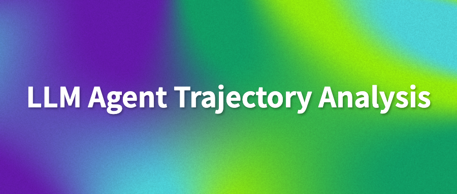

# Awesome LLM Agent Trajectory Analysis: Failure Attribution, Enhancement & Optimization, Repair, Debugging

<div align="center">
  
</div>

[](https://awesome.re)
[](https://opensource.org/licenses/MIT)
[](http://makeapullrequest.com)
[](./LLMAgentTraceAnalysisSurvey.pdf)

A curated repository for **LLM Agent Trajectory Analysis**, based on the survey:
**A Survey for LLM Agent Trajectory Analysis: From Failure Attribution to Enhancement** (Junjie Wang et al., 2026).

🔥🔥 Our paper is now published! Check out ["A Survey for LLM Agent Trajectory Analysis: From Failure Attribution to Enhancement"](https://www.researchgate.net/publication/401193207_A_Survey_for_LLM_Agent_Trajectory_Analysis_From_Failure_Attribution_to_Enhancement) on [ResearchGate](https://www.researchgate.net/publication/401193207_A_Survey_for_LLM_Agent_Trajectory_Analysis_From_Failure_Attribution_to_Enhancement) or [Github](./LLMAgentTraceAnalysisSurvey.pdf).

This repository targets key search topics in this area, including **LLM agent failure attribution**, **trajectory-based debugging**, **root cause analysis**, **agent repair**, and **enhancement/optimization of LLM agent systems**.

This repo organizes the field along five dimensions:
1. Failure Taxonomy
2. Failure Attribution
3. System Enhancement and Optimization
4. Trajectory Monitoring and Analysis Tools
5. Datasets and Benchmarks

## Contact

For questions, suggestions, or collaboration opportunities, please feel free to reach out:

**Junjie Wang**  
📧 Email:  [junjie@iscas.ac.cn](mailto:junjie@iscas.ac.cn)

**Mengzhuo Chen**  
📧 Email:  [chenmengzhuo2023@iscas.ac.cn](mailto:chenmengzhuo2023@iscas.ac.cn)

## Table of Contents

- [Why This Topic](#why-this-topic)
- [Keywords / Search Terms](#keywords--search-terms)
- [Survey at a Glance](#survey-at-a-glance)
- [Paper Collection Protocol](#paper-collection-protocol)
- [Awesome Paper List](#awesome-paper-list)
  - [Failure Taxonomy](#failure-taxonomy)
  - [Failure Attribution Methods for LLM Agents](#failure-attribution-methods-for-llm-agents)
  - [Enhancement, Optimization, and Repair](#enhancement-optimization-and-repair)
  - [Trajectory Monitoring, Debugging, and Analysis Tools](#trajectory-monitoring-debugging-and-analysis-tools)
  - [Datasets and Benchmarks for Failure Attribution and Repair](#datasets-and-benchmarks-for-failure-attribution-and-repair)
  - [Others and Empirical Studies](#others-and-empirical-studies)
- [Open Challenges](#open-challenges)
- [How to Contribute](#how-to-contribute)
- [Citation](#citation)
- [Contact](#contact)
- [License](#license)

## Why This Topic

LLM-based agent systems increasingly behave like a new software paradigm. Their failures are often not deterministic code bugs, but are embedded in long, language-heavy, multi-step trajectories (reasoning, communication, tool use, environment feedback). This makes trajectory analysis the core path for:
- Diagnosing failures
- Attributing root causes
- Guiding system-level fixes and optimization

## Keywords / Search Terms

`LLM agent failure attribution`, `failure attribution`, `agent failure analysis`, `trajectory analysis`, `trajectory-based debugging`, `root cause analysis`, `agent repair`, `enhancement optimization`, `LLM agent optimization`, `agent debugging`, `AgentOps`, `LLM multi-agent systems`

## Survey at a Glance

- Time window covered: early 2025 to **February 2026**
- Total collected papers: **42**
- Core technical focus:
  - Failure attribution (18 papers)
  - Enhancement/optimization (8 papers)
- Supporting foundations:
  - Failure taxonomy
  - Monitoring/analysis tools
  - Benchmarks/datasets

Key observations from the survey:
- Attribution methods have evolved from prompting-based inspection to causal inference, specialized tracer models, and intervention-driven runtime analysis.
- Step-level attribution remains challenging (around 40% in common benchmark settings).
- Benchmark diversity and observability are still bottlenecks.

## Paper Collection Protocol

The survey uses:
- Automated search on ACM DL, IEEE Xplore, arXiv, DBLP
- Manual search in major SE/AI venues
- Backward snowballing
- Inclusion/exclusion criteria + quality checklist

From 1,452 initially retrieved papers, 42 were retained for final analysis.

## Awesome Paper List

### Failure Taxonomy

- TRAIL: Trace Reasoning and Agentic Issue Localization <a href="https://arxiv.org/abs/2505.08638" target="_blank"></a> <a href="https://github.com/patronus-ai/trail-benchmark" target="_blank"></a>
- Aegis: Taxonomy and Optimizations for Overcoming Agent-environment Failures in LLM Agents <a href="https://arxiv.org/abs/2508.19504" target="_blank"></a>
- Exploring Autonomous Agents: A Closer Look at Why They Fail When Completing Tasks <a href="https://arxiv.org/abs/2508.13143" target="_blank"></a>
- Where LLM Agents Fail and How They Can Learn From Failures <a href="https://arxiv.org/abs/2509.25370" target="_blank"></a> <a href="https://github.com/ulab-uiuc/AgentDebug" target="_blank"></a>
- Why Do Multi-Agent LLM Systems Fail? <a href="https://arxiv.org/abs/2503.13657" target="_blank"></a> <a href="https://github.com/multi-agent-systems-failure-taxonomy/MAST" target="_blank"></a>
- How Do LLMs Fail In Agentic Scenarios? A Qualitative Analysis of Success and Failure Scenarios of Various LLMs in Agentic Simulations <a href="https://arxiv.org/abs/2512.07497" target="_blank"></a>
- AgentRx: Diagnosing AI Agent Failures from Execution Trajectories <a href="https://arxiv.org/abs/2602.02475" target="_blank"></a>
- Demystifying the Lifecycle of Failures in Platform-Orchestrated Agentic Workflows <a href="./papers/AgentFail.pdf" target="_blank"></a>

### Failure Attribution Methods for LLM Agents

#### Pattern Analysis-Based

- Who is Introducing the Failure? Automatically Attributing Failures of Multi-Agent Systems via Spectrum Analysis (FAMAS) <a href="https://arxiv.org/abs/2509.13782" target="_blank"></a>
- Traceability and Accountability in Role-Specialized Multi-Agent LLM Pipelines <a href="https://arxiv.org/abs/2510.07614" target="_blank"></a> <a href="https://sites.google.com/view/mas-gain2025/home" target="_blank"></a>
- CORRECT: Condensed eRror Recognition via Knowledge Transfer in Multi-Agent Systems <a href="https://arxiv.org/abs/2509.24088" target="_blank"></a>
- Scope Delineation Before Localization (SDBL) <a href="https://arxiv.org/abs/2512.15374" target="_blank"></a> <a href="https://github.com/JarvisPei/SCOPE" target="_blank"></a>

#### LLM Reasoning-Based

- Which Agent Causes Task Failures and When? <a href="https://arxiv.org/abs/2505.00212" target="_blank"></a> <a href="https://github.com/ag2ai/Agents_Failure_Attribution" target="_blank"></a>
- Where Did It All Go Wrong? A Hierarchical Look into Multi-Agent Error Attribution (ECHO) <a href="https://arxiv.org/abs/2510.04886" target="_blank"></a>
- RAFFLES: Reasoning-based Attribution of Faults for LLM Systems <a href="https://arxiv.org/abs/2509.06822" target="_blank"></a>
- Automatic Failure Attribution and Critical Step Prediction based on Causal Inference (CDC-MAS) <a href="https://arxiv.org/abs/2509.08682" target="_blank"></a>
- Abduct, Act, Predict: Scaffolding Causal Inference for Automated Failure Attribution in Multi-Agent Systems <a href="https://arxiv.org/abs/2509.10401" target="_blank"></a> <a href="https://github.com/ResearAI/A2P" target="_blank"></a>
- From Flat Logs to Causal Graphs (CHIEF) <a href="./papers/CHIEF.pdf" target="_blank"></a>
- AgentRx: Diagnosing AI Agent Failures from Execution Trajectories <a href="https://arxiv.org/abs/2602.02475" target="_blank"></a>

#### Model Fine-Tuning-Based

- AgenTracer: Who Is Inducing Failure in the LLM Agentic Systems? <a href="https://arxiv.org/abs/2509.03312" target="_blank"></a> <a href="https://github.com/bingreeky/AgenTracer" target="_blank"></a>
- GraphTracer: Graph-Guided Failure Tracing in LLM Agents <a href="https://arxiv.org/abs/2510.10581" target="_blank"></a>
- Aegis: Automated Error Generation and Attribution for Multi-Agent Systems <a href="https://arxiv.org/abs/2509.14295" target="_blank"></a>

#### Dynamic Runtime-Based

- DoVer: Intervention-Driven Auto Debugging for LLM Multi-Agent Systems <a href="https://arxiv.org/abs/2512.06749" target="_blank"></a> <a href="https://mbjinx.github.io/DoVer_Web/" target="_blank"></a>
- AgentDebug (Where LLM Agents Fail and How They can Learn From Failures) <a href="https://arxiv.org/abs/2509.25370" target="_blank"></a> <a href="https://github.com/ulab-uiuc/AgentDebug" target="_blank"></a>
- TraceElephant: Seeing the Whole Elephant for Failure Attribution in LLM-based Multi-Agent Systems <a href="./papers/TraceElephant.pdf" target="_blank"></a> <a href="https://github.com/TraceElephant/TraceElephant" target="_blank"></a>
- Demystifying the Lifecycle of Failures in Platform-Orchestrated Agentic Workflows <a href="./papers/AgentFail.pdf" target="_blank"></a>

### Enhancement, Optimization, and Repair

#### Structural and Workflow Optimization

- Aegis: Taxonomy and Optimizations for Overcoming Agent-Environment Failures in LLM Agents <a href="https://arxiv.org/abs/2508.19504" target="_blank"></a>
- Maestro: Joint Graph & Config Optimization for Reliable AI Agents <a href="https://arxiv.org/abs/2509.04642" target="_blank"></a>
- Failure-Driven Workflow Refinement (CE-Graph) <a href="https://arxiv.org/abs/2510.10035" target="_blank"></a>
- Instruction-Level Weight Shaping (ILWS) <a href="https://arxiv.org/abs/2509.00251" target="_blank"></a>

#### Agent Internal Optimization

- SCOPE: Prompt Evolution for Enhancing Agent Effectiveness <a href="https://arxiv.org/abs/2512.15374" target="_blank"></a> <a href="https://github.com/JarvisPei/SCOPE" target="_blank"></a>
- AgentDevel: Reframing Self-Evolving LLM Agents as Release Engineering <a href="https://arxiv.org/abs/2601.04620" target="_blank"></a>
- ReCreate: Reasoning and Creating Domain Agents Driven by Experience <a href="https://arxiv.org/abs/2601.11100" target="_blank"></a> <a href="https://github.com/zz-haooo/ReCreate" target="_blank"></a>

#### Runtime and Supervisory Optimization

- Improving the Efficiency of LLM Agent Systems through Trajectory Reduction (AgentDiet) <a href="https://arxiv.org/abs/2509.23586" target="_blank"></a>
- Stop Wasting Your Tokens: Towards Efficient Runtime Multi-Agent Systems (SUPERVISOR AGENT) <a href="https://arxiv.org/abs/2510.26585" target="_blank"></a>

### Trajectory Monitoring, Debugging, and Analysis Tools

#### System-Level Monitoring and Passive Diagnosis

- AgentSight: System-Level Observability for AI Agents using eBPF <a href="https://dl.acm.org/doi/10.1145/3766882.3767169" target="_blank"></a> <a href="https://github.com/eunomia-bpf/agentsight" target="_blank"></a>
- Taming Uncertainty via Automation: Observing, Analyzing, and Optimizing Agentic AI Systems <a href="https://arxiv.org/abs/2507.11277" target="_blank"></a>
- AgentDiagnose: An Open Toolkit for Diagnosing LLM Agent Trajectories <a href="https://aclanthology.org/2025.emnlp-demos.15/" target="_blank"></a> <a href="https://github.com/oootttyyy/AgentDiagnose" target="_blank"></a>
- Agent Trajectory Explorer: Visualizing and Providing Feedback on Agent Trajectories <a href="https://doi.org/10.1609/aaai.v39i28.35350" target="_blank"></a>

#### Interactive Analysis and Active Debugging

- Interactive Debugging and Steering of Multi-Agent AI Systems (AGDebugger) <a href="https://doi.org/10.1145/3706598.3713581" target="_blank"></a> <a href="https://github.com/microsoft/agdebugger" target="_blank"></a>
- XAgen: An Explainability Tool for Identifying and Correcting Failures in Multi-Agent Workflows <a href="https://arxiv.org/abs/2512.17896" target="_blank"></a>
- DiLLS: Interactive Diagnosis of LLM-based Multi-agent Systems via Layered Summary of Agent Behaviors <a href="https://arxiv.org/abs/2602.05446" target="_blank"></a>

### Datasets and Benchmarks for Failure Attribution and Repair

#### Real-World Failure Collection

- Who&When <a href="https://arxiv.org/abs/2505.00212" target="_blank"></a> <a href="https://github.com/ag2ai/Agents_Failure_Attribution" target="_blank"></a>: 127 trajectories
- TRAIL <a href="https://arxiv.org/abs/2505.08638" target="_blank"></a> <a href="https://github.com/patronus-ai/trail-benchmark" target="_blank"></a>: 148 trajectories
- AgentErrorBench <a href="https://arxiv.org/abs/2509.25370" target="_blank"></a> <a href="https://github.com/ulab-uiuc/AgentDebug" target="_blank"></a>: 200 trajectories
- TraceElephant <a href="./papers/TraceElephant.pdf" target="_blank"></a> <a href="https://github.com/TraceElephant/TraceElephant" target="_blank"></a>: 220 trajectories, full observability + reproducible environment
- Demystifying the Lifecycle of Failures in Platform-Orchestrated Agentic Workflows <a href="./papers/AgentFail.pdf" target="_blank"></a>: 307 trajectories, lifecycle-level annotation + repair strategy
- AgentRx <a href="https://arxiv.org/abs/2602.02475" target="_blank"></a>: first unrecoverable failure step annotation

#### Synthetic Data via Error Injection

- Aegis <a href="https://arxiv.org/abs/2509.14295" target="_blank"></a>: 9,533 trajectories
- CORRECT-Error <a href="https://arxiv.org/abs/2509.24088" target="_blank"></a>: 2,000+ trajectories

### Others and Empirical Studies

- Understanding Software Engineering Agents: A Study of Thought-Action-Result Trajectories <a href="https://arxiv.org/abs/2506.18824" target="_blank"></a>
- MAESTRO: Multi-Agent Evaluation Suite for Testing, Reliability, and Observability <a href="https://arxiv.org/abs/2601.00481" target="_blank"></a> <a href="https://github.com/sands-lab/maestro" target="_blank"></a>
- Trajectory Guard — A Lightweight, Sequence-Aware Model for Real-Time Anomaly Detection in Agentic AI <a href="https://arxiv.org/abs/2601.00516" target="_blank"></a>
- From Features to Actions: Explainability in Traditional and Agentic AI Systems <a href="https://arxiv.org/abs/2602.06841" target="_blank"></a> <a href="https://vectorinstitute.github.io/unified-xai-evaluation-framework/" target="_blank"></a>

## Open Challenges

- Improve attribution accuracy through stronger causal modeling of trajectories.
- Move from attribution accuracy metrics to repair-utility and enhancement-oriented metrics.
- Build richer, larger, and more diverse full-observability benchmarks.
- Shift evaluation from binary success/failure to multi-dimensional capability assessment.
- Evolve from fragmented tools toward integrated AgentOps governance.
- Expand from controlled benchmarks to production and domain-specific settings (coding, GUI, web, embodied agents).

## How to Contribute

Contributions are welcome. You can help by:
- Adding new papers (2026+)
- Improving taxonomy/category mapping
- Adding benchmark metadata and reproducibility resources
- Fixing links and metadata errors

Please open a PR with:
- Paper title
- Link (arXiv/DOI/project)
- Venue and date
- Suggested category (one of the five dimensions)
- Short note (optional)

## Citation

```bibtex
@article{wang2026surveytrajectory,
  title={A Survey for LLM Agent Trajectory Analysis: From Failure Attribution to Enhancement},
  author={Wang, Junjie and Wang, Yawen and Chen, Mengzhuo and Xie, Xiaofei and Chen, Chunyang and Mu, Fangwen and Liu, Zhe and Wang, Qing},
  year={2026}
}
```

## License

This repository is released under the [MIT License](./LICENSE).
